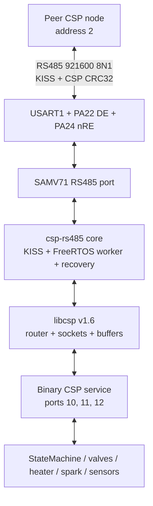
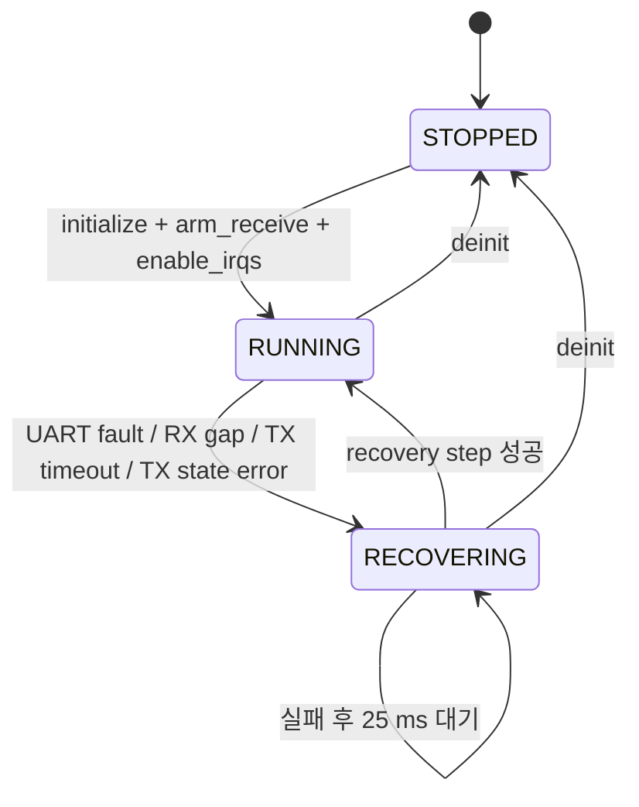

# SAMV71 libcsp + csp-rs485 Porting Design

- 작성일: 2026-08-06
- 대상 저장소: `C:\PSC\SAM_CTL_Control - IO`
- 참조 저장소: `C:\PSC\csp-rs485`
- 상태: 대화형 설계 승인 완료, 서면 스펙 검토 대기

## 1. 목적

현재 USART1 기반 `uartcomm`과 `$iGRVT50,...` ASCII 명령/텔레메트리 계층을 다음 구조로 완전히 교체한다.

1. 공식 libcsp v1.6
2. csp-rs485의 재사용 가능한 KISS/FreeRTOS 링크 코어
3. ATSAMV71Q21B 전용 RS485 port
4. 고정폭 정수 기반 Binary CSP 명령·텔레메트리 서비스

최종 firmware에서 USART1은 CSP RS485 port만 소유한다. 기존 ASCII parser, raw telemetry, `uartcomm` backend, 임시 전환 selector는 최종 단계에서 제거한다.

## 2. 승인된 핵심 결정

| 항목 | 결정 |
|---|---|
| 애플리케이션 프로토콜 | 신규 Binary schema v1 |
| RS485 토폴로지 | 1:1 point-to-point |
| libcsp 반입 | 공식 저장소 submodule, v1.6 commit 고정 |
| csp-rs485 반입 | 공통 `include`/`src` 파일 복사, provenance 문서화 |
| 전환 전략 | 단계적 cutover 후 legacy 완전 제거 |
| 초기 RX 방식 | USART1 interrupt RX |
| 무결성 | CSP CRC32 필수 |
| 제외 기능 | RDP, HMAC, XTEA, multidrop, multi-master, 주기 telemetry push |

## 3. 기준 상태

### 3.1 대상 플랫폼

- MCU: ATSAMV71Q21B, Cortex-M7, 300 MHz
- Toolchain: MPLAB X/Harmony 3, XC32 v5.10, C17
- RTOS: FreeRTOS 10.5.1, 1 kHz tick, `configMAX_PRIORITIES=5`
- 현재 RTOS 설정:
  - dynamic allocation 활성화
  - static allocation 비활성화
  - heap 40,960 bytes
  - software timer 비활성화
- USART1:
  - PA21: RXD1
  - PB4: TXD1
  - PA22: RS485 DE, active high
  - PA24: RS485 nRE, active low
  - 921600 baud, 8N1
  - NVIC priority 7
- D-cache가 활성화되어 있으므로 향후 DMA 적용 시 cache coherency 설계가 필요하다.

현재 `sam_ctl.X/iGRVT50/source/uartcomm.c`가 USART1 RX ISR hook, software ring, blocking TX를 소유하고 `src/opu_task.c`의 `RsTask`가 ASCII 명령을 해석한다. 두 계층은 CSP와 동시에 USART1을 사용할 수 없다.

### 3.2 참조 csp-rs485

- repository tag: `1.0.0`
- repository commit: `56addf6e936e78e3090b43ef5c3c8d60542f3b94`
- nested libcsp gitlink: `87006959696c78f70535ab382b0bcd4cb5a6558d`
- 재사용 코어:
  - `csp_rs485/include/csp_rs485_link.h`
  - `csp_rs485/include/csp_rs485_port.h`
  - `csp_rs485/include/csp_rs485_profile.h`
  - `csp_rs485/src/csp_rs485_internal.h`
  - `csp_rs485/src/csp_rs485_freertos.c`
  - `csp_rs485/src/csp_rs485_kiss.c`
  - `csp_rs485/src/csp_rs485_link.c`
  - `csp_rs485/src/csp_rs485_supervisor.c`

STM32 HAL/DMA port는 복사하지 않는다. SAMV71 port는 대상 저장소가 별도로 소유한다.

## 4. 범위

### 4.1 포함

- libcsp v1.6 빌드 및 FreeRTOS 설정
- csp-rs485 공통 코어 반입
- USART1 interrupt RX 및 blocking whole-frame TX port
- CSP route, router task, service socket
- Binary command, telemetry, diagnostics
- 기존 actuator/state/sensor domain API 재사용
- host, target, hardware, stress, recovery 검증
- 기존 USART1/ASCII 계층 제거

### 4.2 제외

- 여러 노드가 공유하는 multidrop 또는 multi-master RS485
- 충돌 감지, arbitration, backoff
- 초기 구현의 XDMAC RX
- RDP/HMAC/XTEA 및 별도 애플리케이션 암호화
- 주기적 telemetry push 또는 subscription
- 통신 손실 시 자동 `EnterSafeState()` 호출
- CSP와 무관한 application refactoring

통신 손실과 actuator 안전 상태의 결합은 기존 `StateMachine` 안전 정책의 소유권을 침범하지 않도록 v1 범위에서 제외한다.

## 5. 의존성 및 디렉터리 구조

```text
SAM_CTL_Control - IO/
├─ third_party/
│  ├─ libcsp/                       # official git submodule
│  └─ csp-rs485/
│     ├─ include/                   # copied reusable headers
│     ├─ src/                       # copied reusable sources
│     └─ UPSTREAM.md                # source/revision/license/sync evidence
├─ sam_ctl.X/iGRVT50/
│  ├─ header/csp/
│  │  ├─ sam_csp_config.h
│  │  ├─ sam_csp_protocol.h
│  │  ├─ sam_csp_runtime.h
│  │  └─ samv71_rs485_port.h
│  └─ source/csp/
│     ├─ sam_csp_codec.c
│     ├─ sam_csp_service.c
│     ├─ sam_csp_runtime.c
│     └─ samv71_rs485_port.c
└─ docs/superpowers/specs/
```

### 5.1 libcsp

- URL: `https://github.com/libcsp/libcsp.git`
- version: v1.6
- commit: `87006959696c78f70535ab382b0bcd4cb5a6558d`
- top-level `third_party/libcsp` submodule로 직접 고정한다.
- csp-rs485 내부의 nested libcsp 경로는 반입하거나 빌드하지 않는다.
- 해당 commit의 `COPYING`은 GNU LGPL v2.1을 명시한다. License text를 보존하고 firmware 배포·static linking에 적용되는 의무는 제품 배포 전에 조직의 compliance 절차로 확인한다.

### 5.2 csp-rs485

`UPSTREAM.md`는 다음 정보를 필수로 기록한다.

- 원본 repository/path
- tag와 full commit
- 복사한 파일의 명시적 목록
- 원본과 대상 파일의 checksum 또는 diff 검증 방법
- upstream test 명령과 결과
- 동기화 절차
- 사용·복사·재배포 권한 근거

참조 repository에서 top-level LICENSE가 확인되지 않았으므로 실제 복사 전에 repository 소유권 또는 사용·재배포 권한을 확인한다. 권한 근거가 없으면 csp-rs485 파일 복사를 진행하지 않는다.

## 6. 전체 아키텍처



계층별 소유권은 다음과 같다.

| 계층 | 책임 | 의존 대상 |
|---|---|---|
| Binary codec | bytewise encode/decode, length/value validation | 고정폭 정수만 사용 |
| CSP service | port/opcode dispatch, transaction response | codec, domain API, libcsp socket |
| CSP runtime | csp init, route, router/service tasks | libcsp, csp-rs485 link |
| csp-rs485 core | KISS, CSP interface, stream, TX mutex, recovery | port operation table, FreeRTOS |
| SAMV71 port | USART1, DE/nRE, IRQ, TX deadline | Harmony PLIB/registers |
| Domain | 실제 제어 및 상태 취득 | 기존 application modules |

## 7. 빌드 및 구성

### 7.1 빌드 소유권

- production source/include 목록은 `sam_ctl.X/nbproject/configurations.xml`을 기준으로 한다.
- MPLAB export 후 `cmake/sam_ctl/default/.generated` mirror를 재생성한다.
- CMake 수동 보완이 필요하면 generated 파일을 직접 수정하지 않고 `cmake/sam_ctl/default/user.cmake`에 둔다.
- XC32 debug/release 구성을 모두 빌드한다.
- C17 `_Atomic` 지원을 사용하며 lock-free 32-bit atomic 전제를 compile-time assert로 확인한다.

### 7.2 libcsp compile profile

SAMV71 소유 `csp_autoconfig.h`는 다음 profile을 사용한다.

- `CSP_FREERTOS=1`
- `CSP_POSIX=0`
- `CSP_USE_CRC32=1`
- `CSP_USE_RDP=0`
- `CSP_USE_HMAC=0`
- `CSP_USE_XTEA=0`
- `CSP_USE_QOS=0`
- `CSP_USE_DEDUP=0`
- `CSP_LITTLE_ENDIAN=1`
- error logging 활성화, verbose debug logging 비활성화

Runtime `csp_conf_t` 기준값:

| 항목 | 값 |
|---|---:|
| local address | 1 |
| peer address | 2 |
| connections | 4 |
| connection queue length | 10 |
| FIFO length | 25 |
| buffers | 20 |
| buffer data size | 300 bytes |
| maximum bound service port | 12 |

주소 1과 2는 `sam_csp_config.h`에서 제품별로 변경할 수 있지만 서로 달라야 하며 libcsp 주소 범위를 벗어나면 compile 또는 init이 실패해야 한다.

### 7.3 csp-rs485 profile

- CSP buffer data size: 300
- interface MTU: 296
- maximum raw frame: 304
- maximum encoded KISS frame: 611
- RX stream: 8192 logical bytes, FreeRTOS storage 8193 bytes
- RX task work chunk: 2048 bytes
- TX margin: 5 ms
- recovery retry: 25 ms

`csp_rs485_link_init()`의 compile/runtime validation을 유지하며 target에서 제한값을 완화하지 않는다.

## 8. FreeRTOS 실행 모델

`configSUPPORT_STATIC_ALLOCATION`을 1로 변경하고 `freertos_hooks.c`에 idle task용 `vApplicationGetIdleTaskMemory()`를 구현한다. Dynamic allocation과 40,960-byte heap은 libcsp startup allocation 및 기존 application을 위해 유지한다. Software timer는 사용하지 않는다.

| Task | Priority | Stack | Allocation |
|---|---:|---:|---|
| libcsp router | 4 | 512 words | static |
| csp-rs485 link/recovery | 3 | 512 words | static |
| Binary CSP service | 2 | 512 words | static |
| 기존 control/sensor tasks | 기존 0–2 | 기존 값 | 기존 정책 |

csp-rs485 자체 static RAM은 stream storage, RX chunk, TX frame, task/TCB/semaphore를 포함해 약 13–14 KiB이다. Router와 service stack은 합계 4 KiB를 추가한다. libcsp buffer/connection의 실제 heap 비용은 ELF map과 FreeRTOS heap watermark로 검증한다.

### 8.1 초기화 순서

1. Harmony pin initialization에서 DE=0, nRE=0을 설정한다.
2. 기존 sensor/actuator boot-safe initialization을 수행한다.
3. `csp_conf_get_defaults()` 후 승인된 runtime 값을 적용하고 `csp_init()`을 호출한다.
4. SAMV71 port context와 operation table로 `csp_rs485_link_init()`을 호출한다.
5. peer address 2 route를 RS485 interface에 등록한다.
6. static router task를 생성한다.
7. 하나의 service socket을 `CSP_ANY`에 bind하고 static service task를 생성한다. Custom ports 10–12는 Binary service가 처리한다. 표준 port 중 `CSP_PING`만 `csp_service_handler(conn, packet)`에 위임하고 나머지 reserved/unknown port는 packet을 해제한 뒤 응답 없이 폐기한다.
8. 모든 단계 성공 후 application에서 CSP service ready를 게시한다.

실패 시 USART1을 receive-safe 상태로 두고 CSP service를 ready로 게시하지 않는다. 실패 원인은 USART0 debug와 내부 health counter로 관찰한다.

## 9. CSP 및 Binary Wire Contract

### 9.1 CSP transport contract

- topology: node 1 ↔ node 2 point-to-point
- requests와 responses 모두 CSP CRC32를 사용한다.
- KISS frame 자체에 별도 checksum을 추가하지 않는다.
- RDP를 사용하지 않는다.
- libcsp 기본 service는 `CSP_PING`만 allowlist한다. Remote reboot와 그 밖의 표준 service는 v1에서 노출하지 않는다.
- application packet 최대 길이는 66 bytes로 MTU 296보다 작다.
- 서비스는 request/response 방식이며 unsolicited periodic telemetry를 보내지 않는다.

### 9.2 Service ports

| Destination port | Service | Opcode |
|---:|---|---|
| 10 | Command | `0x01 SET_OUTPUTS`, `0x02 SET_MODE` |
| 11 | Telemetry | `0x01 GET_SNAPSHOT` |
| 12 | Diagnostics | `0x01 GET_HEALTH` |

libcsp 예약 service port와 충돌하지 않도록 custom port는 10 이상을 사용한다.

### 9.3 Encoding rules

- protocol version: 1
- 모든 multi-byte integer: network byte order, big endian
- signed integer: 2의 보수
- float 및 native enum 전송 금지
- packed C struct의 memory image 직접 전송 금지
- bytewise helper로 encode/decode
- 메시지 종류별 정확한 packet length만 허용
- reserved byte와 미사용 mask bit는 0이어야 한다.

### 9.4 Common request header

모든 request는 4-byte header로 시작한다.

| Offset | Size | Field |
|---:|---:|---|
| 0 | 1 | `version`, value 1 |
| 1 | 1 | `opcode` |
| 2 | 2 | `transaction_id`, uint16 BE |

### 9.5 Common response header

모든 response는 6-byte header로 시작한다.

| Offset | Size | Field |
|---:|---:|---|
| 0 | 1 | `version`, value 1 |
| 1 | 1 | request와 동일한 `opcode` |
| 2 | 2 | request와 동일한 `transaction_id` |
| 4 | 1 | `status` |
| 5 | 1 | `detail` |

Status 값:

| Value | Name | 의미 |
|---:|---|---|
| 0 | OK | 요청이 유효하며 software 동작이 수락됨 |
| 1 | BAD_VERSION | 지원하지 않는 protocol version |
| 2 | BAD_LENGTH | 메시지 길이 불일치 |
| 3 | BAD_OPCODE | port에서 지원하지 않는 opcode |
| 4 | INVALID_ARGUMENT | 필드 값 또는 reserved bit 오류 |
| 5 | INVALID_STATE | 현재 state에서 허용되지 않는 명령 |
| 6 | APPLY_FAILED | domain API 적용 실패 |
| 7 | INTERNAL_ERROR | 내부 자원 또는 처리 오류 |
| 8 | BUSY | 현재 요청 처리 불가 |

`detail`은 성공 시 0이며 실패 시 다음 규칙을 사용한다.

| Status | Detail 규칙 |
|---|---|
| BAD_VERSION | 0 |
| BAD_LENGTH | 해당 opcode에서 요구되는 전체 packet length |
| BAD_OPCODE | 수신한 opcode |
| INVALID_ARGUMENT | 처음 잘못된 field의 시작 byte offset |
| INVALID_STATE | 현재 state/mode 값 |
| APPLY_FAILED | 1 SET_OUTPUTS, 2 SET_MODE |
| INTERNAL_ERROR | 1 buffer, 2 snapshot, 3 connection, 255 unspecified |
| BUSY | 0 |

4-byte common request header보다 짧은 packet은 transaction ID를 안전하게 읽을 수 없으므로 응답 없이 폐기하고 malformed counter만 증가시킨다.

### 9.6 SET_OUTPUTS

- port: 10
- opcode: `0x01`
- request length: 10 bytes
- response length: 6 bytes

| Offset | Size | Field | Validation |
|---:|---:|---|---|
| 0–3 | 4 | common request header | version/opcode |
| 4 | 2 | `lpv_on_mask` | bits 0–11만 허용 |
| 6 | 1 | `hpv_on_mask` | bits 0–7 |
| 7 | 1 | `heater_on_mask` | bits 0–3만 허용 |
| 8 | 1 | `spark_on` | 0 또는 1 |
| 9 | 1 | `reserved` | 반드시 0 |

LPV 12개, HPV 8개, heater 4개, spark 1개를 절대 상태로 지정한다. Heater bit 0은 0%, bit 1은 100%로 기존 SVCON 동작을 보존한다. 모든 필드를 먼저 검증한 후 한 번의 domain-level apply 함수로 넘긴다. 논리적으로는 전부 수락되거나 전부 거부되지만 실제 GPIO switching이 동시 edge임을 보장하지는 않는다.

절대 상태 명령이므로 같은 transaction을 재수신해도 결과는 동일하다. v1은 별도의 duplicate cache를 두지 않는다.

### 9.7 SET_MODE

- port: 10
- opcode: `0x02`
- request length: 5 bytes
- response length: 6 bytes

| Offset | Size | Field |
|---:|---:|---|
| 0–3 | 4 | common request header |
| 4 | 1 | mode: 0 INIT, 1 NORMAL, 2 RUN, 3 DIAGNOSTIC |

OK는 `StateMachine_RequestMode()`가 요청을 수락했다는 의미이며 mode transition 완료를 의미하지 않는다. 실제 결과는 telemetry의 `current_mode`와 `requested_mode`로 확인한다.

### 9.8 GET_SNAPSHOT

- port: 11
- opcode: `0x01`
- request length: 4 bytes
- success response length: 66 bytes
- error response length: 6 bytes

| Offset | Size | Field |
|---:|---:|---|
| 0–5 | 6 | common response header |
| 6–9 | 4 | `sample_time_ms`, uint32 |
| 10 | 1 | `current_mode` |
| 11 | 1 | `requested_mode` |
| 12–13 | 2 | `validity_mask`, uint16 |
| 14–49 | 36 | `pt_millivolt[9]`, int32 array |
| 50–65 | 16 | `tc_microvolt[4]`, int32 array |

Validity bits 0–8은 PT 1–9, bits 9–12는 TC 1–4를 나타낸다. 나머지 bits는 0이다. 각 acquisition task가 첫 유효 sample을 게시하기 전에는 해당 bit를 0으로 하고 값도 0으로 encode한다. Sensor state는 service task가 먼저 local snapshot으로 복사한 뒤 encode하여 서로 다른 acquisition 시점의 필드 혼합을 제한한다.

### 9.9 GET_HEALTH

- port: 12
- opcode: `0x01`
- request length: 4 bytes
- success response length: 58 bytes
- error response length: 6 bytes

| Offset | Size | Field |
|---:|---:|---|
| 0–5 | 6 | common response header |
| 6–9 | 4 | `uptime_ms`, uint32 |
| 10 | 1 | link state: 0 STOPPED, 1 RUNNING, 2 RECOVERING |
| 11 | 1 | last error: 0 NONE, 1 UART, 2 DMA, 3 TX_TIMEOUT, 4 TX_STATE |
| 12–13 | 2 | reserved, value 0 |
| 14–57 | 44 | 11 × uint32 counters |

Counter 순서:

1. `uart_errors`
2. `dma_errors`
3. `tx_timeouts`
4. `tx_failures`
5. `protocol_errors`
6. `stream_dropped_bytes`
7. `stream_high_watermark`
8. `stream_discontinuities`
9. `recovery_attempts`
10. `recovery_successes`
11. `recovery_failures`

Interrupt RX 구현에서는 `dma_errors`가 항상 0이다. 향후 XDMAC 구현으로 port 내부가 교체되어도 wire contract는 유지한다.

## 10. Binary Service 처리 흐름

1. service task가 CSP connection을 accept하고 destination port를 읽는다.
2. packet이 최소 request header를 포함하는지 확인한다. 4 bytes보다 짧으면 malformed counter를 증가시키고 응답 없이 폐기한다.
3. version, opcode, exact length를 확인한다.
4. bytewise decode 후 mask, enum, reserved 값을 확인한다.
5. validation이 모두 성공한 경우에만 domain API를 호출하거나 snapshot을 생성한다.
6. 동일 transaction ID를 넣은 response를 송신한다.
7. packet과 connection을 모든 경로에서 해제한다.

잘못된 Binary request는 actuator를 변경하지 않고 common 6-byte NACK를 반환한다. 단, common header보다 짧은 packet에는 응답하지 않는다. CSP CRC 오류와 유효 KISS frame이 되지 않은 데이터는 application service에 도달하지 않으므로 응답하지 않는다. Response buffer를 할당할 수 없으면 내부 counter를 증가시키고 connection을 정리한다.

## 11. SAMV71 RS485 Port

SAMV71 port는 `csp_rs485_port_ops_t` 전체를 구현한다.

| Operation | SAMV71 동작 |
|---|---|
| `initialize` | GPIO receive-safe, USART reset, fractional 921600 8N1, 상태 초기화 |
| `arm_receive` | error/RHR flush, RX 상태 arm |
| `enable_irqs` | RXRDY/FRAME/PARE/OVRE 활성화 |
| `disable_and_clear_irqs` | USART source mask와 NVIC pending clear |
| `abort_receive` | RX 중지 및 오류 상태 clear |
| `deinitialize` | USART disable, IRQ off, receive-safe 유지 |
| `force_receive_mode` | RTOS 없이 DE=0/nRE=0 직접 GPIO write |
| `reset_rx_position` | port-local RX cursor와 임시 buffering 경계 reset; 누적 health counter는 유지 |
| `transmit_frame` | whole-frame blocking TX와 deadline 처리 |

### 11.1 Generated PLIB 경계

현재 `plib_usart1.c`는 `USART1_UartCommRxReadyHook()`과 `USART1_UartCommErrorHook()` weak hook을 제공한다. 초기 port는 generated vector와 handler를 교체하지 않고 이 두 ABI symbol을 strong definition으로 구현한다. Symbol 이름은 legacy 흔적이지만 구현은 SAMV71 CSP port가 소유한다.

`uartcomm.c`를 동시에 링크하면 strong symbol 충돌과 USART1 이중 소유가 생기므로 build selector는 둘 중 하나만 source 목록에 포함해야 한다. 최종 cutover에서는 `uartcomm.c/.h`를 source 목록과 repository에서 제거한다.

Harmony 재생성 시 custom weak hook이 사라질 수 있으므로 generated diff 검증을 build 절차에 넣는다. 장기적으로는 Harmony 설정 또는 reproducible patch로 hook을 보존한다.

### 11.2 Boot-safe GPIO

- PA22 DE를 GPIO output low로 생성한다.
- PA24 nRE를 RTS peripheral이 아닌 GPIO output low로 생성한다.
- boot pin initialization 이후 port init 전까지 DE=0/nRE=0을 유지한다.
- `force_receive_mode()`는 init 실패, TX 실패, timeout, recovery, deinit의 공통 cleanup에서 항상 호출 가능해야 한다.

### 11.3 RX ISR

- USART1 interrupt priority 7을 유지한다.
- RXRDY 상태에서 RHR byte를 읽고 csp-rs485 ISR stream API에 전달한다.
- ISR에서는 KISS parsing, CSP routing, allocation, recovery sequence를 수행하지 않는다.
- FRAME/PARE/OVRE 발생 시 오류 상태를 clear하고 RX discontinuity와 fault를 ISR-safe API로 게시한다.
- ISR 종료 시 필요한 경우에만 `portYIELD_FROM_ISR()`를 수행한다.

921600 8N1의 worst-case byte rate는 약 92,160 bytes/s이며 byte interrupt 구현은 같은 규모의 IRQ를 만들 수 있다. 초기 포팅은 DMA/cache 위험을 피하기 위해 interrupt RX를 사용하되 다음 중 하나가 발생하면 v1 hardware acceptance 실패로 판정한다.

- USART overrun 또는 csp-rs485 stream drop 발생
- 기존 10 ms/50 ms/1 s application deadline 위반
- watchdog margin 훼손
- stress 중 protocol resynchronization이 지속적으로 발생

실패 시 `csp_rs485_port_ops_t`와 상위 계층은 변경하지 않고 RX 내부만 XDMAC double/circular buffer로 전환하는 별도 후속 설계를 수행한다.

### 11.4 TX sequence

1. parameter, port state, frame length를 검증한다.
2. RX-related USART IRQ를 mask한다.
3. nRE를 high로 설정해 local receiver를 비활성화한다.
4. DE를 high로 설정하고 약 1 bit time의 enable guard를 둔다.
5. TXRDY를 polling하며 전체 KISS frame을 THR에 기록한다.
6. 같은 absolute deadline 안에서 TXEMPTY를 기다린다.
7. DE=0, nRE=0으로 복귀한다.
8. RX 상태를 clear/arm하고 RX IRQ를 복원한다.

csp-rs485는 `frame wire time + 5 ms`를 timeout으로 넘긴다. 611-byte maximum KISS frame의 wire time은 약 6.7 ms이므로 정상 maximum deadline은 약 12 ms이다.

성공·timeout·state error·기타 오류는 하나의 cleanup 경로로 합류한다. Partial frame은 자동 재전송하지 않는다. Port는 `OK`, `TIMEOUT`, `STATE_ERROR`, `ERROR`로 결과를 분류하고 csp-rs485 core가 health 및 recovery 상태를 갱신하게 한다.

## 12. Recovery 및 오류 처리



Recovery step은 csp-rs485 supervisor 순서를 그대로 사용한다.

1. force receive mode
2. IRQ disable/clear
3. abort receive
4. deinitialize
5. RX position reset와 KISS discontinuity 표시
6. initialize
7. arm receive
8. IRQ enable 및 RUNNING 게시

Cleanup 일부가 실패해도 이후 단계는 계속 수행한다. Reinit/arm 실패 시 receive-safe 상태로 25 ms 대기한 뒤 재시도한다. RECOVERING에서는 새로운 TX를 거부한다.

Link recovery는 actuator 출력을 자동 변경하지 않는다. Remote control이 불가능한 상태에서의 안전 출력 정책은 기존 StateMachine 또는 별도 safety requirement가 결정한다.

## 13. 단계적 Cutover

| Stage | 변경 | Exit gate |
|---:|---|---|
| 0 | baseline build/map/UART/git 상태 기록 | 현재 firmware 재현 가능 |
| 1 | libcsp submodule, csp-rs485 core, build metadata | XC32 debug/release compile, 새 warning 없음 |
| 2 | FreeRTOS static allocation과 core host tests | static task/stream startup와 upstream tests 통과 |
| 3 | SAMV71 RS485 port | Python peer KISS vectors, max frame, fault recovery 통과 |
| 4 | libcsp init, route, router/service socket | node 1↔2 ping/echo, CRC rejection, health 조회 |
| 5 | Binary application services | ports 10–12 end-to-end, USART1 owner CSP only |
| 6 | legacy removal | `uartcomm`, ASCII parser, temporary selector 제거 후 full regression |

Stages 1–5에서는 회귀 비교를 위해 compile-time backend selector를 임시로 허용한다. 한 firmware image에는 legacy 또는 CSP backend 중 하나만 포함한다. Stage 6에서 selector와 legacy backend를 제거한다.

기존 `RsTask`의 통신 parsing/formatting은 제거하지만 actuator/sensor/state domain logic은 작은 명시적 API로 분리해 CSP service가 재사용한다. 통신 변경과 무관한 control 동작은 수정하지 않는다.

## 14. 검증 계획

### 14.1 Host

- request/response golden vectors
- endian 및 signed integer vectors
- 최소/최대 mask
- 잘못된 version, opcode, length, reserved bit, enum
- invalid command에서 domain mock 호출 0회
- KISS escape/unescape와 maximum frame
- CRC corruption, truncation, garbage resynchronization
- fake port timeout/state error/recovery
- csp-rs485 원본 host test suite

### 14.2 Target build 및 정적 분석

- XC32 debug/release build
- 새 compiler warning 0
- libcsp buffer data size 300 compile/runtime assert
- atomic assumption assert
- ELF map의 flash/RAM 변화 기록
- static object, heap allocation 및 section 배치 확인

### 14.3 Hardware physical layer

- reset부터 DE=0/nRE=0
- 정상 TX의 nRE→DE 순서와 TXEMPTY 후 receive 복귀
- maximum KISS frame timing
- back-to-back request/response
- UART FRAME/PARE/OVRE fault injection
- TX timeout injection 후 DE/nRE receive-safe
- truncated/corrupted/garbage stream 후 다음 valid frame 복구

### 14.4 CSP/application end-to-end

- node 1↔2 route 및 ping/echo
- CRC32 오류 frame rejection
- SET_OUTPUTS mask와 실제 output mapping
- SET_MODE acceptance와 transition telemetry
- PT 9채널 mV, TC 4채널 µV 단위 검증
- GET_HEALTH counter 변화
- duplicate absolute command idempotency
- buffer allocation 실패와 connection cleanup

### 14.5 Stress

- 10분간 maximum-rate alternating traffic
- 1시간 10 Hz application request/response soak
- 100회 UART/TX recovery injection

합격 기준:

- stream drop와 UART overrun 0
- memory leak 0
- 정상 hardware 상태에서 recovery 250 ms 이내
- 각 CSP task stack의 minimum free watermark가 configured stack의 25% 이상
- `xPortGetMinimumEverFreeHeapSize()` 8 KiB 이상
- 기존 time-critical control task deadline 위반 0

## 15. 완료 조건

다음 조건을 모두 만족해야 porting 완료로 판정한다.

- 공식 libcsp v1.6 URL/tag/full commit을 재현할 수 있다.
- copied csp-rs485 core의 tag/full commit/file list/checksum/권한 근거가 기록되어 있다.
- Binary schema v1과 golden vectors가 repository에 있다.
- USART1, DE, nRE를 SAMV71 CSP port만 소유한다.
- 기존 `$iGRVT50` ASCII parsing/telemetry와 `uartcomm`이 제거됐다.
- temporary backend selector가 제거됐다.
- 모든 오류와 deinit 경로가 receive-safe다.
- XC32 debug/release와 전체 host/hardware/stress matrix가 통과한다.
- ELF map, heap/stack watermark, link health, logic analyzer 증적이 보관된다.

## 16. 주요 위험과 대응

| 위험 | 대응 |
|---|---|
| 92 kIRQ/s 수준의 interrupt RX 부하 | 정량 stress gate; 실패 시 동일 port API 아래 XDMAC 후속 설계 |
| Harmony 재생성으로 USART hook 손실 | generated diff 검증 및 reproducible patch/config 유지 |
| libcsp/csp-rs485 buffer 설정 불일치 | data size 300 compile/runtime assert |
| heap/stack 부족 | map, minimum-ever heap, stack watermark 합격 기준 |
| TX timeout 후 driver enable 고착 | 단일 receive-safe cleanup와 logic analyzer fault test |
| peer와 schema 불일치 | byte offset 명세와 양쪽 golden vectors 공유 |
| copied source provenance 또는 권한 불명확 | UPSTREAM.md gate를 통과하기 전 파일 반입 금지 |

이 설계는 하나의 구현 계획으로 실행 가능한 범위다. XDMAC 전환 또는 multidrop 지원이 필요해지면 별도 설계와 구현 계획으로 분리한다.
